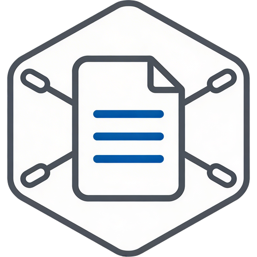
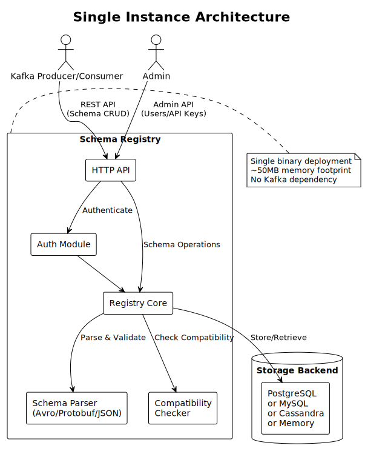
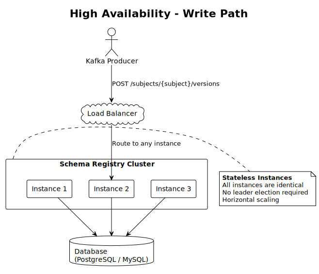
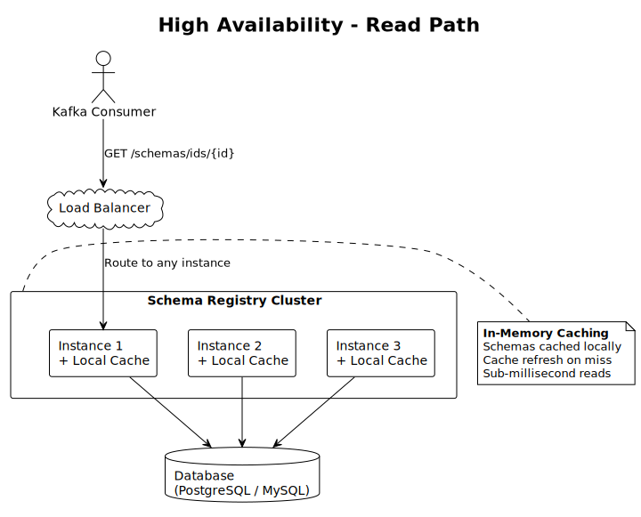
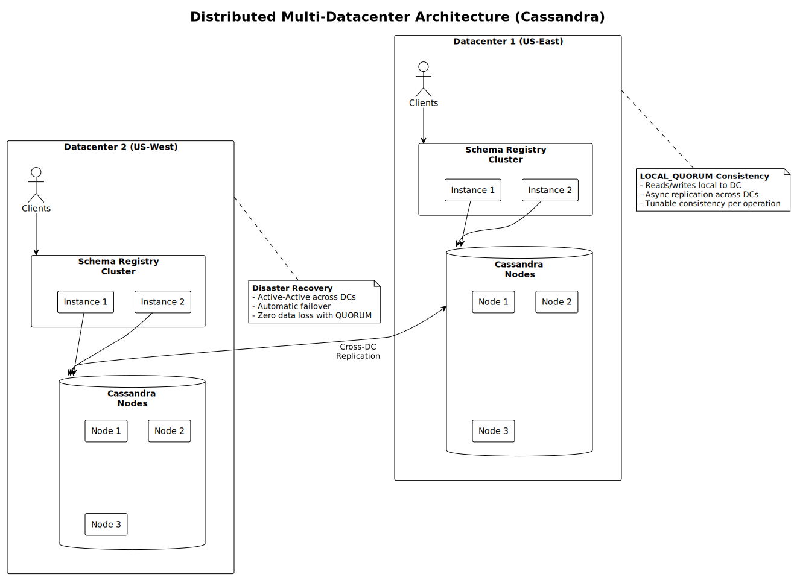
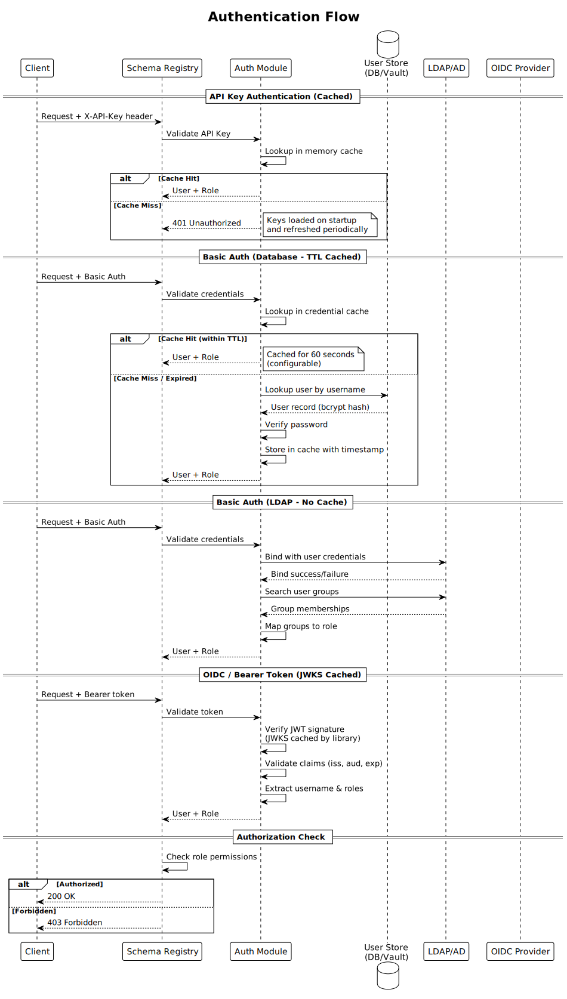
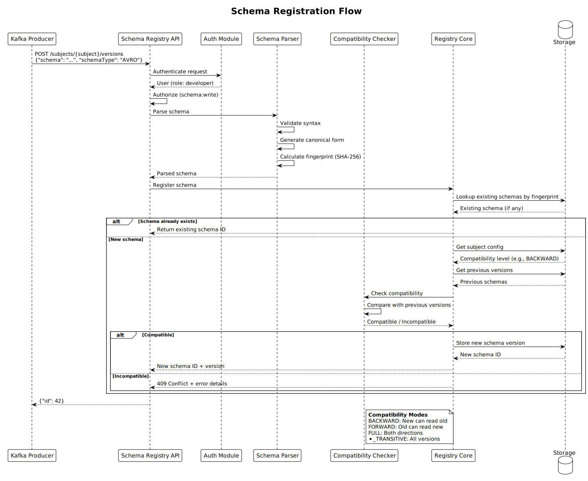

<div align="center">
  

  # AxonOps Schema Registry

  **High-Performance, API-Compatible Drop-In Replacement for Confluent Schema Registry**

  [](LICENSE)
  [](https://go.dev/)
  [](https://github.com/axonops/axonops-schema-registry/issues)

  [Getting Started](docs/getting-started.md) | [Documentation](docs/) | [API Reference](docs/api-reference.md) | [Report Issue](https://github.com/axonops/axonops-schema-registry/issues/new/choose)

</div>

---

## Overview

[AxonOps Schema Registry](https://github.com/axonops/axonops-schema-registry) is a **schema registry for Apache Kafka** that manages and enforces schemas for event-driven architectures. It stores versioned Avro, Protobuf, and JSON Schema definitions, validates compatibility between schema versions, and ensures producers and consumers agree on data formats.

Unlike Confluent Schema Registry, it **does not require Kafka or ZooKeeper** for its own storage -- it uses standard databases (PostgreSQL, MySQL, or Cassandra) while remaining **fully API-compatible** with Confluent's REST API, serializers, and client libraries.

<div align="center">

  ### 100% Free & Open Source

  **Apache 2.0 Licensed -- No hidden costs -- No premium tiers -- No license keys**

</div>

## Contents

- [Why AxonOps Schema Registry?](#why-axonops-schema-registry)
- [Quick Start](#quick-start)
- [Features](#features)
- [Feature Comparison](#feature-comparison)
- [Architecture](#architecture)
- [API Compatibility](#api-compatibility)
- [Documentation](#documentation)
- [Development](#development)
- [Community & Support](#community--support)
- [License](#license)
- [Legal Notices](#legal-notices)

## Why AxonOps Schema Registry?

- **No Kafka/ZooKeeper Dependency** -- uses standard databases (PostgreSQL, MySQL, Cassandra) for storage
- **Single Binary** -- ~50 MB memory footprint, zero runtime dependencies
- **Full API Compatibility** -- works with Confluent serializers for Java, Go, and Python
- **Enterprise Security** -- LDAP, OIDC, mTLS, API keys, JWT, and RBAC out of the box
- **Cloud Native** -- designed for Kubernetes with health checks, Prometheus metrics, and graceful shutdown
- **Multi-Datacenter** -- active-active deployments with Cassandra's native cross-DC replication

## Quick Start

```bash
# Start with Docker (in-memory storage, no database required)
docker run -d -p 8081:8081 ghcr.io/axonops/axonops-schema-registry:latest

# Verify
curl http://localhost:8081/

# Register a schema
curl -X POST http://localhost:8081/subjects/users-value/versions \
  -H "Content-Type: application/vnd.schemaregistry.v1+json" \
  -d '{"schema": "{\"type\": \"record\", \"name\": \"User\", \"fields\": [{\"name\": \"id\", \"type\": \"int\"}, {\"name\": \"name\", \"type\": \"string\"}]}"}'

# Check compatibility
curl -X POST http://localhost:8081/compatibility/subjects/users-value/versions/latest \
  -H "Content-Type: application/vnd.schemaregistry.v1+json" \
  -d '{"schema": "{\"type\": \"record\", \"name\": \"User\", \"fields\": [{\"name\": \"id\", \"type\": \"int\"}, {\"name\": \"name\", \"type\": \"string\"}, {\"name\": \"email\", \"type\": [\"null\", \"string\"], \"default\": null}]}"}'
```

See the [Getting Started](docs/getting-started.md) guide for Kafka client integration examples in Java, Go, and Python.

---

## Features

### Schema Management

- **Multi-Format** -- Avro, Protocol Buffers (proto2/proto3), JSON Schema
- **Schema References** -- cross-subject dependencies for all three schema types
- **7 Compatibility Modes** -- NONE, BACKWARD, FORWARD, FULL, and transitive variants
- **Normalization** -- canonical form generation for content-addressed deduplication
- **Soft Delete** -- recoverable deletion with permanent delete option

### Storage Backends

<div align="center">

| Backend | Use Case | Concurrency Model |
|---------|----------|-------------------|
| **PostgreSQL** | Production | ACID transactions with row-level locking |
| **MySQL** | Production | ACID transactions with `SELECT ... FOR UPDATE` |
| **Cassandra 5+** | Distributed / HA | Lightweight transactions (LWT) + SAI indexes |
| **Memory** | Development | Mutex-based, no persistence |

</div>

> **Note:** The Cassandra storage backend requires **Cassandra 5.0 or later**. Earlier versions are not supported.

Auth storage can optionally be separated into HashiCorp Vault.

### Security

- **Authentication** -- Basic Auth, API Keys, JWT, LDAP/AD, OIDC, mTLS
- **Authorization** -- RBAC with 4 built-in roles (super_admin, admin, developer, readonly)
- **Rate Limiting** -- Token bucket algorithm, per-client or per-endpoint
- **Audit Logging** -- Structured JSON events to file or stdout
- **TLS** -- Auto-reload certificates, configurable minimum version, mutual TLS

### Operations

- **Prometheus Metrics** -- 19 metrics covering requests, schemas, compatibility, storage, cache, auth, and rate limiting
- **Health Checks** -- `GET /` for load balancer and Kubernetes probes
- **Swagger UI** -- Built-in interactive API documentation at `GET /docs`
- **Graceful Shutdown** -- Clean connection draining on SIGTERM/SIGINT
- **Database Migrations** -- Automatic schema creation and upgrades

---

## Feature Comparison

*Comparison based on upstream/default configurations. Third-party plugins may extend capabilities.*

<div align="center">

| Feature | AxonOps | Confluent OSS | Confluent Enterprise | Karapace |
|---------|---------|---------------|---------------------|----------|
| **License** | Apache 2.0 | Confluent Community | Commercial | Apache 2.0 |
| **Language** | Go | Java | Java | Python |
| **API Compatibility** | Full | N/A | N/A | Full |
| **Avro Support** | Yes | Yes | Yes | Yes |
| **Protobuf Support** | Yes | Yes | Yes | Yes |
| **JSON Schema Support** | Yes | Yes | Yes | Yes |
| **Schema References** | Yes | Yes | Yes | Yes |
| **Compatibility Modes** | All 7 modes | All 7 modes | All 7 modes | All 7 modes |
| **Storage: Kafka** | No | Yes | Yes | Yes |
| **Storage: PostgreSQL** | Yes | No | No | No |
| **Storage: MySQL** | Yes | No | No | No |
| **Storage: Cassandra** | Yes | No | No | No |
| **No Kafka Dependency** | Yes | No | No | No |
| **Basic Auth** | Yes | No | Yes | Yes |
| **API Keys** | Yes | No | Yes | No |
| **LDAP/AD** | Yes | No | Yes | No |
| **OIDC/OAuth2** | Yes | No | Yes | No |
| **mTLS** | Yes | Yes | Yes | Yes |
| **RBAC** | Yes | No | Yes | Limited |
| **Audit Logging** | Yes | No | Yes | No |
| **Rate Limiting** | Yes | No | No | No |
| **Prometheus Metrics** | Yes | Yes | Yes | Yes |
| **REST Proxy** | No | Separate | Separate | Yes |
| **Schema Validation** | Yes | Yes | Yes | Yes |
| **Single Binary** | Yes | No | No | No |
| **Memory Footprint** | ~50MB | ~500MB+ | ~500MB+ | ~200MB+ |

</div>

---

## Architecture

### Single Instance



A single stateless binary connecting to any supported storage backend. Suitable for development, testing, or low-traffic production.

### High Availability (PostgreSQL/MySQL)

**Write Path:**



**Read Path:**



Multiple stateless instances behind a load balancer. No leader election, no inter-instance coordination. Database-level concurrency control ensures consistency.

### Distributed Multi-Datacenter (Cassandra)



Active-active across datacenters with automatic cross-DC replication via Cassandra. Lightweight transactions ensure atomic ID allocation and fingerprint deduplication.

### Authentication Flow



### Schema Registration Flow



---

## API Compatibility

AxonOps Schema Registry implements the Confluent Schema Registry REST API v1:

- **All endpoints** -- schemas, subjects, compatibility, config, mode, import
- **All serializers** -- compatible with Confluent's Avro, Protobuf, and JSON Schema serializers
- **All client libraries** -- works with `confluent-kafka-go`, `confluent-kafka-python`, and Java Kafka clients
- **Error format** -- HTTP status codes and error response JSON match Confluent behavior

**Known differences:**

- Contexts are single-tenant only and always return `["."]`
- Cluster coordination uses database constraints instead of Kafka

---

## Documentation

<div align="center">

| Guide | Description |
|-------|-------------|
| [Getting Started](docs/getting-started.md) | Run the registry and register your first schemas in five minutes |
| [Installation](docs/installation.md) | Docker, APT, YUM, binary, Kubernetes, and from-source installation |
| [Configuration](docs/configuration.md) | Complete YAML reference with all fields, defaults, and environment variables |
| [Storage Backends](docs/storage-backends.md) | PostgreSQL, MySQL, Cassandra, and in-memory backend setup and tuning |
| [Schema Types](docs/schema-types.md) | Avro, Protobuf, and JSON Schema support with reference examples |
| [Compatibility](docs/compatibility.md) | All 7 compatibility modes with per-type rules and configuration |
| [API Reference](docs/api-reference.md) | All 47+ endpoints with parameters, examples, and error codes |
| [Authentication](docs/authentication.md) | All 6 auth methods, RBAC, user management, and admin CLI |
| [Security](docs/security.md) | TLS, rate limiting, audit logging, credential storage, and hardening checklist |
| [Deployment](docs/deployment.md) | Topologies, Docker Compose, Kubernetes manifests, systemd, and health checks |
| [Monitoring](docs/monitoring.md) | Prometheus metrics, alerting rules, structured logging, and Grafana queries |
| [Migration](docs/migration.md) | Migrating from Confluent Schema Registry with preserved schema IDs |
| [Development](docs/development.md) | Building from source, running the test suite, and contributing |
| [Troubleshooting](docs/troubleshooting.md) | Common issues, diagnostic commands, and error code reference |

</div>

---

## Development

### Building from Source

```bash
git clone https://github.com/axonops/axonops-schema-registry.git
cd axonops-schema-registry
make build
```

### Running Tests

```bash
# Unit tests
make test

# Integration tests (requires Docker)
make test-integration

# BDD tests
make test-bdd

# All tests with coverage
make test-coverage
```

See the [Development](docs/development.md) guide for the full build, test, and contribution workflow.

### Contributing

We welcome contributions from the community. Please read the [Development](docs/development.md) guide before submitting pull requests. It covers:

- Code conventions and project structure
- Testing philosophy and how to write tests
- Step-by-step developer workflows
- How to update the API and regenerate documentation

---

## Community & Support

- **GitHub Issues** -- [Report bugs or request features](https://github.com/axonops/axonops-schema-registry/issues/new/choose)
- **GitHub Discussions** -- [Ask questions and share ideas](https://github.com/axonops/axonops-schema-registry/discussions)
- **Website** -- [axonops.com](https://axonops.com)

If you find AxonOps Schema Registry useful, please consider giving us a star!

---

## License

Apache License 2.0 -- see [LICENSE](LICENSE) for details.

---

## Legal Notices

*This project may contain trademarks or logos for projects, products, or services. Any use of third-party trademarks or logos is subject to those third parties' policies.*

- **AxonOps** is a registered trademark of AxonOps Limited.
- **Apache**, **Apache Cassandra**, **Cassandra**, **Apache Kafka**, and **Kafka** are either registered trademarks or trademarks of the Apache Software Foundation or its subsidiaries in Canada, the United States, and/or other countries.

---

<div align="center">

  Made with :heart: by the [AxonOps](https://axonops.com) team

  Copyright &copy; 2025 AxonOps Limited

</div>
