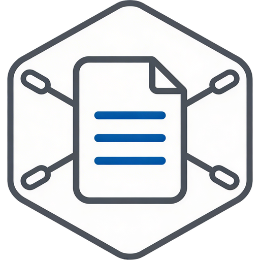

<div align="center">
  

  # AxonOps Schema Registry

  **Drop-in Confluent Replacement with Extra REST APIs, Enterprise Security, Multi-Backend Storage, and Built-in MCP Server**

  [](LICENSE)
  [](https://go.dev/)
  [](https://github.com/axonops/axonops-schema-registry)
  [](https://github.com/axonops/axonops-schema-registry/issues)

  [Getting Started](docs/getting-started.md) | [Documentation](docs/) | [API Reference](docs/api-reference.md) | [MCP Server](docs/mcp.md) | [Report Issue](https://github.com/axonops/axonops-schema-registry/issues/new/choose)

</div>

---

## Overview

[AxonOps](https://axonops.com) Schema Registry is a **schema registry for Apache Kafka&reg;** that goes beyond Schema Registry compatibility — it gives you every Confluent Schema Registry REST API (including [Enterprise-only](https://docs.confluent.io/platform/current/schema-registry/develop/api.html) endpoints like contexts, data contracts, CSFLE encryption, and exporters) **plus** a large set of [additional REST APIs](#axonops-extensions) for schema analysis, quality scoring, field search, and admin management — all under the Apache 2.0 license. It also ships with a built-in [Model Context Protocol (MCP)](https://modelcontextprotocol.io/) server that lets AI assistants like Claude, Cursor, and VS Code Copilot work directly with your schemas through natural language.

Unlike Confluent Schema Registry, which uses Kafka itself (a special `_schemas` topic) as its storage backend, AxonOps Schema Registry **does not require Kafka** for storage -- it uses standard databases (PostgreSQL, MySQL, or Cassandra) while remaining **fully API-compatible** with the Confluent Schema Registry REST API, serializers, and client libraries. On top of the Schema Registry compatible endpoints, AxonOps adds a substantial set of [extra REST API endpoints](#axonops-extensions) for schema analysis, quality scoring, field/type search, similarity detection, migration planning, and administrative operations — plus an MCP server with extensive tools, resources, and prompts for AI-assisted workflows.

<div align="center">

  ### 100% Free & Open Source

  **Apache 2.0 Licensed -- No hidden costs -- No premium tiers -- No license keys**

</div>

## Contents

- [Why AxonOps Schema Registry?](#why-axonops-schema-registry)
- [Feature Comparison](#feature-comparison)
- [Quick Start](#quick-start)
- [Features](#features)
- [MCP Server (AI-Assisted Schema Management)](#mcp-server-ai-assisted-schema-management)
- [Architecture](#architecture)
- [API Compatibility](#api-compatibility)
- [Strict Specification Compliance](#strict-specification-compliance)
- [Schema Registry Ecosystem](#schema-registry-ecosystem)
- [Documentation](#documentation)
- [Development](#development)
- [Community & Support](#community--support)
- [License](#license)
- [Acknowledgements](#acknowledgements)
- [Legal Notices](#legal-notices)

**New to schema registries?** Read the [Fundamentals](docs/fundamentals.md) guide to understand what a schema registry is, why it matters, and how it fits into an event-driven architecture. **Ready to design your schemas?** See [Best Practices](docs/best-practices.md) for patterns, naming conventions, and evolution strategies.

## Why AxonOps Schema Registry?

- **No Kafka Dependency** -- uses standard databases (PostgreSQL, MySQL, Cassandra) instead of Kafka for storage
- **Single Binary** -- ~50 MB memory footprint, zero runtime dependencies
- **Full API Compatibility** -- works with Confluent serializers for Java, Go, and Python
- **Enterprise Security** -- LDAP, OIDC, mTLS, API keys, JWT, and RBAC out of the box
- **Cloud Native** -- designed for Kubernetes with health checks, Prometheus metrics, and graceful shutdown
- **Multi-Datacenter** -- active-active deployments with Cassandra's native cross-DC replication
- **Enterprise Features, Zero Cost** -- RBAC, data contracts, CSFLE encryption, audit logging, and rate limiting are included free under Apache 2.0. With Confluent, these require a [commercial Enterprise license](https://docs.confluent.io/platform/current/installation/license.html).
- **More REST APIs** -- beyond full Schema Registry compatibility (Community + Enterprise), AxonOps adds [many additional REST endpoints](#axonops-extensions) for schema analysis, quality scoring, field/type search, similarity detection, migration planning, and admin management
- **Strict Specification Compliance** -- enforces Avro, Protobuf, and JSON Schema specifications more faithfully than Confluent, catching invalid schemas at registration time rather than at runtime ([details](#strict-specification-compliance))
- **Built-in API Documentation** -- OpenAPI spec with Swagger UI and ReDoc, always in sync with the codebase
- **AI-Ready** -- built-in [MCP server](docs/mcp.md) with extensive tools, resources, and prompts for AI-assisted schema management via Claude, Cursor, VS Code Copilot, and other MCP-compatible clients

## Feature Comparison

*Comparison based on upstream/default configurations. Third-party plugins may extend capabilities.*

<div align="center">

| Feature | AxonOps | Confluent OSS | Confluent Enterprise | Karapace |
|---------|---------|---------------|---------------------|----------|
| **License** | Apache 2.0 | Confluent Community | Commercial | Apache 2.0 |
| **Language** | Go | Java | Java | Python |
| **API Compatibility** | Full | N/A | N/A | Full |
| **Avro** | ✅ | ✅ | ✅ | ✅ |
| **Protobuf** | ✅ | ✅ | ✅ | ✅ |
| **JSON Schema** | ✅ | ✅ | ✅ | ✅ |
| [**Schema References**](docs/schema-types.md) | ✅ | ✅ | ✅ | ✅ |
| [**All 7 Compat Modes**](docs/compatibility.md) | ✅ | ✅ | ✅ | ✅ |
| **Storage: Kafka** | ❌ | ✅ | ✅ | ✅ |
| [**Storage: PostgreSQL**](docs/storage-backends.md) | ✅ | ❌ | ❌ | ❌ |
| [**Storage: MySQL**](docs/storage-backends.md) | ✅ | ❌ | ❌ | ❌ |
| [**Storage: Cassandra**](docs/storage-backends.md) | ✅ | ❌ | ❌ | ❌ |
| **No Kafka Dependency** | ✅ | ❌ | ❌ | ❌ |
| [**Basic Auth**](docs/authentication.md) | ✅ | ✅ &sup3; | ✅ | ⚠️ ⁴ |
| [**API Keys**](docs/authentication.md) | ✅ | ❌ | ✅ | ❌ |
| [**LDAP/AD**](docs/authentication.md) | ✅ | ⚠️ &sup3; | ✅ | ❌ |
| [**OIDC/OAuth2**](docs/authentication.md) | ✅ | ✅ &sup3; | ✅ | ❌ |
| **mTLS** | ✅ | ✅ | ✅ | ✅ |
| [**RBAC**](docs/authentication.md) | ✅ | ❌ | ✅ | ⚠️ Limited |
| [**Audit Logging**](docs/security.md) | ✅ | ❌ | ✅ | ❌ |
| [**Rate Limiting**](docs/security.md) | ✅ | ❌ | ❌ | ❌ |
| [**Prometheus Metrics**](docs/monitoring.md) | ✅ | ✅ | ✅ | ✅ |
| **REST Proxy** | ❌ | Separate | Separate | ✅ |
| **Schema Validation** | ✅ | ✅ | ✅ | ✅ |
| [**Strict Spec Compliance**](#strict-specification-compliance) | ✅ | ❌ | ❌ | ⚠️ Partial |
| [**Data Contracts**](docs/data-contracts.md) | ✅ | ❌ | ✅ | ❌ |
| [**Multi-Tenant Contexts**](docs/contexts.md) | ✅ | ✅ | ✅ | ❌ |
| [**DEK Registry (CSFLE)**](docs/encryption.md) | ✅ | ❌ | ✅ | ❌ |
| [**KMS Providers**](docs/encryption.md) | 2 + 3 &sup1; | ❌ | ✅ | ❌ |
| [**Exporter API**](docs/exporters.md) &sup2; | ✅ | ❌ | ✅ | ❌ |
| [**Extra REST APIs**](docs/api-reference.md#axonops-extensions) ⁵ | ✅ | ❌ | ❌ | ❌ |
| [**MCP Server (AI)**](docs/mcp.md) | ✅ | ❌ | ❌ | ❌ |
| **Single Binary** | ✅ | ❌ | ❌ | ❌ |
| **Memory Footprint** | ~50MB | ~500MB+ | ~500MB+ | ~200MB+ |

</div>

&sup1; HashiCorp Vault and OpenBao Transit are production-ready. AWS KMS, Azure Key Vault, and GCP KMS support is coming soon.

&sup2; Confluent-compatible exporter management API for schema replication configuration. AxonOps stores exporter definitions; active cross-registry replication requires an external agent.

&sup3; Confluent OSS authentication requires Java JAAS LoginModule configuration. AxonOps provides all authentication methods as built-in features with simple YAML configuration -- no Java runtime, no external plugins, no license keys.

⁴ Karapace uses its own ACL-based credential mechanism rather than standard HTTP Basic Authentication.

⁵ Additional AxonOps REST APIs beyond the Schema Registry compatible surface: schema analysis and quality scoring, field/type search, similarity detection, compatibility suggestions, migration planning, registry statistics, user and API key admin, self-service account management, and built-in API documentation. See [AxonOps Extensions](#axonops-extensions).

> **In short:** AxonOps gives you **every Confluent Schema Registry REST API** (Community + Enterprise) plus **many additional REST endpoints** and a **built-in MCP server** — all under the Apache 2.0 license, in a single ~50 MB binary, with no Kafka dependency for storage. You get Enterprise-grade capabilities (data contracts, client-side encryption, RBAC, audit logging, multi-tenant contexts, rate limiting) **and** advanced schema analysis, quality scoring, field search, similarity detection, and AI-assisted schema management that no other registry offers. If you need enterprise support, [AxonOps](https://axonops.com) offers commercial support plans.

## Quick Start

```bash
# Start with Docker (in-memory storage, no database required)
docker run -d -p 8081:8081 ghcr.io/axonops/axonops-schema-registry:latest

# Verify
curl http://localhost:8081/

# Register a schema
curl -X POST http://localhost:8081/subjects/users-value/versions \
  -H "Content-Type: application/vnd.schemaregistry.v1+json" \
  -d '{"schema": "{\"type\": \"record\", \"name\": \"User\", \"fields\": [{\"name\": \"id\", \"type\": \"int\"}, {\"name\": \"name\", \"type\": \"string\"}]}"}'

# Check compatibility
curl -X POST http://localhost:8081/compatibility/subjects/users-value/versions/latest \
  -H "Content-Type: application/vnd.schemaregistry.v1+json" \
  -d '{"schema": "{\"type\": \"record\", \"name\": \"User\", \"fields\": [{\"name\": \"id\", \"type\": \"int\"}, {\"name\": \"name\", \"type\": \"string\"}, {\"name\": \"email\", \"type\": [\"null\", \"string\"], \"default\": null}]}"}'
```

See the [Getting Started](docs/getting-started.md) guide for Kafka client integration examples in Java, Go, and Python.

---

## Features

### Schema Management

- **Multi-Format** -- Avro, Protocol Buffers (proto2/proto3), JSON Schema
- **Schema References** -- cross-subject dependencies for all three schema types
- **7 Compatibility Modes** -- NONE, BACKWARD, FORWARD, FULL, and transitive variants
- **Normalization** -- canonical form generation for content-addressed deduplication
- **Soft Delete** -- recoverable deletion with permanent delete option
- **Multi-Tenant Contexts** -- namespace isolation with independent schema IDs, subjects, compatibility config, and modes per context ([docs](docs/contexts.md))
- **Data Contracts** -- schema metadata (tags, properties, sensitive fields), rule sets (domain rules, migration rules, encoding rules), and config-level defaults/overrides with 3-layer merge ([docs](docs/data-contracts.md))

### Encryption

- **DEK Registry** -- Client-Side Field Level Encryption (CSFLE) with KEK/DEK management, compatible with Confluent's Enterprise CSFLE feature ([docs](docs/encryption.md))
- **KMS Providers** -- HashiCorp Vault and OpenBao Transit for production use. AWS KMS, Azure Key Vault, and GCP KMS coming soon.
- **Exporter API** -- Confluent-compatible exporter management API for schema replication configuration ([docs](docs/exporters.md))

### Storage Backends

<div align="center">

| Backend | Use Case | Concurrency Model |
|---------|----------|-------------------|
| **PostgreSQL** | Production | ACID transactions with row-level locking |
| **MySQL** | Production | ACID transactions with `SELECT ... FOR UPDATE` |
| **Cassandra 5+** | Distributed / HA | Lightweight transactions (LWT) + SAI indexes |
| **Memory** | Development | Mutex-based, no persistence |

</div>

> **Note:** The Cassandra storage backend requires **Cassandra 5.0 or later**. Earlier versions are not supported.

Auth storage can optionally be separated into HashiCorp Vault.

### Security

- **Authentication** -- Basic Auth, API Keys, JWT, LDAP/AD, OIDC, mTLS
- **Authorization** -- RBAC with 4 built-in roles (super_admin, admin, developer, readonly)
- **Rate Limiting** -- Token bucket algorithm, per-client or per-endpoint
- **Audit Logging** -- Structured JSON events to file or stdout
- **TLS** -- Auto-reload certificates, configurable minimum version, mutual TLS

### Operations

- **Prometheus Metrics** -- 19 metrics covering requests, schemas, compatibility, storage, cache, auth, and rate limiting
- **Health Checks** -- `GET /` for load balancer and Kubernetes probes
- **Swagger UI** -- Built-in interactive API documentation at `GET /docs`
- **Graceful Shutdown** -- Clean connection draining on SIGTERM/SIGINT
- **Database Migrations** -- Automatic schema creation and upgrades

### MCP Server (AI-Assisted Schema Management)

AxonOps is the **first schema registry with a built-in [Model Context Protocol](https://modelcontextprotocol.io/) server**, enabling AI assistants to work directly with your schema registry through natural language. Instead of manually writing REST calls or navigating documentation, developers can ask their AI assistant to design schemas, check compatibility, score quality, plan migrations, and explore the registry — all through conversation.

- **Tools** -- full registry CRUD, schema analysis, quality scoring, migration planning, and admin operations
- **Resources** -- direct data access for AI clients (static and templated)
- **Prompts** -- guided workflows for schema design, evolution, compatibility troubleshooting, encryption setup, and more
- **Security** -- bearer token auth, origin validation, read-only mode, tool policies, and two-phase confirmations for destructive operations
- **Compatible with** -- Claude Desktop, Claude Code, Cursor, VS Code Copilot, Windsurf, and any MCP-compatible client
- **Schema Intelligence** -- 9 deterministic analysis tools that give AI assistants deep insight into your registry: field search across all schemas (with fuzzy and regex matching), type search, structural similarity detection (Jaccard index), quality scoring (naming, docs, type safety, evolution readiness), complexity grading, cross-schema pattern detection, compatibility-aware evolution suggestions, and multi-step migration planning
- **Also available as REST** -- all analysis capabilities are exposed as REST endpoints in addition to MCP, for use in CI/CD pipelines and custom tooling

See the [MCP Server Guide](docs/mcp.md) for configuration, client setup, and the full [MCP API Reference](docs/mcp-reference.md).

---

## Architecture

AxonOps Schema Registry is a **single stateless binary** that connects to any supported storage backend. There is no leader election and no inter-instance coordination -- database-level constraints handle concurrency.

- **Single instance** -- one binary, one database connection. Suitable for development or low-traffic production.
- **High availability** -- multiple stateless instances behind a load balancer with database-level locking (PostgreSQL/MySQL).
- **Multi-datacenter** -- active-active across datacenters using Cassandra's native cross-DC replication and lightweight transactions.

See [Deployment](docs/deployment.md) for detailed architecture diagrams, topology options, and production configuration.

---

## API Compatibility

AxonOps Schema Registry implements the full Confluent Schema Registry REST API v1 -- including Enterprise-only features that Confluent charges for -- plus additional AxonOps extensions:

### Confluent Compatible (Community)

These endpoints are compatible with the free/open-source Confluent Schema Registry:

- **Schemas** -- retrieve by ID, list, query types
- **Subjects** -- register, list versions, delete, lookup
- **Config** -- global and per-subject compatibility levels
- **Mode** -- global and per-subject read/write modes
- **Compatibility** -- test schema compatibility without registering
- **Metadata** -- cluster ID, server version
- **Health** -- liveness, readiness, and startup probes

### Confluent Compatible (Enterprise)

These endpoints require a [Confluent Enterprise license](https://docs.confluent.io/platform/current/installation/license.html) in Confluent Platform. **AxonOps includes them free under Apache 2.0:**

- **[Import](docs/migration.md)** -- bulk-import schemas preserving original IDs
- **[Contexts](docs/contexts.md)** -- multi-tenant schema isolation with independent schema IDs, subjects, and config
- **[Exporters](docs/exporters.md)** -- Schema Linking compatible exporter management
- **[DEK Registry](docs/encryption.md)** -- Client-Side Field Level Encryption (CSFLE) with KEK/DEK management

### AxonOps Extensions

These endpoints are unique to AxonOps Schema Registry -- not available in any version of Confluent:

- **[Analysis](docs/api-reference.md#axonops-extensions)** -- schema validation, normalization, quality scoring, field/type search, similarity detection, compatibility suggestions, statistics, diff, export, and migration planning (each with context-scoped variants)
- **[Admin](docs/api-reference.md#axonops-extensions)** -- user and API key management with built-in RBAC
- **[Account](docs/api-reference.md#axonops-extensions)** -- self-service profile and password management
- **[Documentation](docs/api-reference.md#axonops-extensions)** -- built-in Swagger UI and OpenAPI spec serving

See the full [API Reference](docs/api-reference.md) with the [API Compatibility Reference](docs/api-reference.md#api-compatibility-reference) section for detailed endpoint listings.

### Serializer & Client Compatibility

- **All serializers** -- compatible with Confluent's Avro, Protobuf, and JSON Schema serializers
- **All client libraries** -- works with `confluent-kafka-go`, `confluent-kafka-python`, and Java Kafka clients
- **Error format** -- HTTP status codes and error response JSON match Confluent behavior

**Known differences:**

- **Contexts** -- Both Confluent and AxonOps support contexts for multi-tenancy. Subjects can be qualified with a context prefix (e.g., `:.mycontext:my-subject`), and schema IDs are unique within each context. AxonOps also supports URL prefix routing (`/contexts/.mycontext/subjects/...`) as an alternative. See the [Contexts](docs/contexts.md) guide for full documentation.
- **Cluster coordination** -- Confluent uses Kafka's group protocol for leader election between registry instances. AxonOps instances are fully stateless with no leader election -- database-level constraints (transactions, LWTs) handle coordination instead.

---

## Strict Specification Compliance

AxonOps Schema Registry enforces Avro, Protobuf, and JSON Schema specifications more faithfully than Confluent Schema Registry. This catches invalid schemas at registration time -- before they enter your pipeline and cause failures during serialization, deserialization, or code generation.

### Schema Fingerprinting and Deduplication

AxonOps uses **specification-correct canonical forms** for schema fingerprinting, producing better deduplication than Confluent's raw-string approach.

| Behavior | AxonOps | Confluent | Why AxonOps is Better |
|----------|---------|-----------|----------------------|
| **Avro Parsing Canonical Form** | Follows the [Avro spec PCF](https://avro.apache.org/docs/current/specification/#parsing-canonical-form-for-schemas): strips `doc`, `aliases`, and `order` from the fingerprint | Includes `doc`, `aliases`, and `order` in the fingerprint | Two schemas that differ only in documentation or field ordering hints are logically identical. AxonOps correctly assigns them the same global ID, avoiding unnecessary schema proliferation. |
| **JSON Schema key ordering** | Normalizes JSON key order before fingerprinting | Hashes the raw JSON string, so `{"type":"object","properties":...}` and `{"properties":...,"type":"object"}` get different IDs | JSON objects are unordered by specification ([RFC 8259](https://www.rfc-editor.org/rfc/rfc8259#section-4)). AxonOps correctly treats key-reordered schemas as identical. |

### Stricter Schema Validation

Confluent accepts several schemas that violate their respective specifications. AxonOps rejects them at registration time with a `422` error, preventing invalid schemas from entering the registry.

| Invalid Schema | AxonOps | Confluent | Specification Reference |
|---------------|---------|-----------|------------------------|
| **Avro: invalid default type** (e.g., `"default": "not_a_number"` on an `int` field) | Rejects (422) | Accepts (200) | [Avro spec](https://avro.apache.org/docs/current/specification/#schema-record): *"A default value for this field, only used when reading instances that lack this field for schema evolution purposes. [...] The value type must match the field's schema type."* |
| **Avro: enum with empty symbols** (`"symbols": []`) | Rejects (422) | Accepts (200) | [Avro spec](https://avro.apache.org/docs/current/specification/#enums): *"symbols: a JSON array, listing symbols, as JSON strings. All symbols in an enum must be unique."* An empty array produces an unusable enum type with no valid values. |
| **Avro: fixed with size 0** (`"size": 0`) | Rejects (422) | Accepts (200) | [Avro spec](https://avro.apache.org/docs/current/specification/#fixed): *"size: an integer, specifying the number of bytes per value."* A zero-byte fixed type is meaningless and will fail during serialization. |
| **Protobuf: duplicate field numbers** (two fields with the same number in one message) | Rejects (422) | Accepts (200) | [Protobuf spec](https://protobuf.dev/programming-guides/proto3/#assigning): *"Each field in the message definition has a unique number."* Duplicate field numbers produce ambiguous wire format encoding. |
| **Protobuf: unresolvable imports** (`import "nonexistent/file.proto"`) | Rejects (422) | Accepts (200) | [Protobuf spec](https://protobuf.dev/programming-guides/proto3/#importing): Imports must resolve to a known `.proto` file. An unresolvable import will fail at compile time in any language. |

### JSON Schema Draft-07 Boolean Root Schemas

AxonOps supports [boolean root schemas](https://json-schema.org/draft-07/json-schema-core#section-4.3.2) (`true` and `false` as standalone schemas), which are valid in JSON Schema Draft-07 but uncommon. `true` accepts any instance, `false` rejects all instances.

### Impact on Migration

If you are migrating from Confluent and have schemas that contain the invalid patterns listed above, those schemas will be rejected by AxonOps during import. This is by design -- it surfaces latent problems in your schema definitions. You should fix the invalid schemas before migrating.

For the fingerprinting differences, schemas that Confluent stored as separate global IDs (because they differ only in `doc`, `aliases`, `order`, or JSON key ordering) will be correctly deduplicated to a single global ID in AxonOps.

---

## Schema Registry Ecosystem

AxonOps Schema Registry exists within a healthy ecosystem of Kafka schema registry implementations. Confluent created the original Schema Registry and defined the REST API that has become the industry standard — every Kafka serializer and client library speaks this API. We are grateful for that foundational contribution.

AxonOps Schema Registry builds on this standard by implementing the full Confluent Schema Registry REST API (Community and Enterprise editions), adding extra REST APIs for schema analysis and administration, and including a built-in MCP server for AI-assisted workflows — all under the Apache 2.0 license.

We built this project to make schema registry an integral part of any Kafka deployment, without limitations from licensing or costs. Whether you use [AxonOps](https://axonops.com) or not, this project is freely available as part of our commitment to the open-source Kafka community.

See the [Ecosystem Guide](docs/ecosystem.md) for a detailed comparison of Confluent, Karapace, Apicurio, and AxonOps, and guidance on choosing the right registry for your needs.

---

## Documentation

<div align="center">

| Guide | Description |
|-------|-------------|
| [Fundamentals](docs/fundamentals.md) | What is a schema registry, core concepts, and how it fits into Kafka |
| [Best Practices](docs/best-practices.md) | Schema design patterns, naming conventions, evolution strategies, and common mistakes |
| [Getting Started](docs/getting-started.md) | Run the registry and register your first schemas in five minutes |
| [Installation](docs/installation.md) | Docker, APT, YUM, binary, Kubernetes, and from-source installation |
| [Configuration](docs/configuration.md) | Complete YAML reference with all fields, defaults, and environment variables |
| [Storage Backends](docs/storage-backends.md) | PostgreSQL, MySQL, Cassandra, and in-memory backend setup and tuning |
| [Schema Types](docs/schema-types.md) | Avro, Protobuf, and JSON Schema support with reference examples |
| [Compatibility](docs/compatibility.md) | All 7 compatibility modes with per-type rules and configuration |
| [Contexts](docs/contexts.md) | Multi-tenancy via contexts: namespace isolation, qualified subjects, URL routing |
| [Data Contracts](docs/data-contracts.md) | Metadata, rule sets, config defaults/overrides, and governance policies |
| [API Reference](docs/api-reference.md) | All REST endpoints with parameters, examples, and compatibility reference |
| [Authentication](docs/authentication.md) | All 6 auth methods, RBAC, user management, and admin CLI |
| [Security](docs/security.md) | TLS, rate limiting, audit logging, credential storage, and hardening checklist |
| [Deployment](docs/deployment.md) | Architecture diagrams, topologies, Docker Compose, Kubernetes manifests, systemd, and health checks |
| [Monitoring](docs/monitoring.md) | Prometheus metrics, alerting rules, structured logging, and Grafana queries |
| [Migration](docs/migration.md) | Migrating from Confluent Schema Registry with preserved schema IDs |
| [Testing Strategy](docs/testing.md) | Testing philosophy, all test layers, how to run and write tests |
| [Development](docs/development.md) | Building from source, running the test suite, and contributing |
| [Encryption](docs/encryption.md) | DEK Registry, Client-Side Field Level Encryption (CSFLE), and KMS providers |
| [Exporters](docs/exporters.md) | Schema Linking via exporter management API |
| [MCP Server](docs/mcp.md) | AI-assisted schema management via Model Context Protocol |
| [MCP API Reference](docs/mcp-reference.md) | Auto-generated reference for all MCP tools, resources, and prompts |
| [Ecosystem](docs/ecosystem.md) | Schema registry ecosystem overview, comparisons, and choosing the right registry |
| [Troubleshooting](docs/troubleshooting.md) | Common issues, diagnostic commands, and error code reference |

</div>

---

## Development

### Building from Source

```bash
git clone https://github.com/axonops/axonops-schema-registry.git
cd axonops-schema-registry
make build
```

### Running Tests

```bash
# Unit tests
make test

# Integration tests (requires Docker)
make test-integration

# BDD tests
make test-bdd

# All tests with coverage
make test-coverage
```

See the [Development](docs/development.md) guide for the full build, test, and contribution workflow.

### Contributing

We welcome contributions from the community. Please read the [Development](docs/development.md) guide before submitting pull requests. It covers:

- Code conventions and project structure
- Testing philosophy and how to write tests
- Step-by-step developer workflows
- How to update the API and regenerate documentation

---

## Community & Support

- **GitHub Issues** -- [Report bugs or request features](https://github.com/axonops/axonops-schema-registry/issues/new/choose)
- **GitHub Discussions** -- [Ask questions and share ideas](https://github.com/axonops/axonops-schema-registry/discussions)
- **Commercial Support** -- [axonops.com](https://axonops.com) for enterprise support plans
- **Website** -- [axonops.com](https://axonops.com)

If you find AxonOps Schema Registry useful, please consider giving us a star!

---

## License

Apache License 2.0 -- see [LICENSE](LICENSE) for details.

---

## Acknowledgements

This project stands on the shoulders of exceptional open-source work. We are grateful to:

- **[Confluent](https://www.confluent.io/)** — for creating the original Schema Registry, defining the REST API that became the industry standard, and advancing the Kafka ecosystem. Every Kafka serializer and client library speaks the API that Confluent designed, and this project would not exist without that foundational contribution.
- **[Apache Kafka](https://kafka.apache.org/)** — for the event streaming platform at the heart of it all. The Kafka community's commitment to open standards and interoperability is what makes projects like this possible.
- **[Model Context Protocol](https://modelcontextprotocol.io/)** — for the open protocol that enables AI assistants to interact with developer tools. MCP is transforming how developers work with infrastructure, and we are proud to be among the first schema registries to adopt it.
- **[Apache Avro](https://avro.apache.org/)**, **[Protocol Buffers](https://protobuf.dev/)**, and **[JSON Schema](https://json-schema.org/)** — for the serialization formats and schema languages that make schema-driven development possible.

We also want to thank the maintainers of the core Go libraries that power this project:

- [chi](https://github.com/go-chi/chi) (HTTP router), [hamba/avro](https://github.com/hamba/avro) (Avro parsing), [protocompile](https://github.com/bufbuild/protocompile) (Protobuf parsing), [jsonschema](https://github.com/santhosh-tekuri/jsonschema) (JSON Schema validation), [cobra](https://github.com/spf13/cobra) (CLI), [prometheus/client_golang](https://github.com/prometheus/client_golang) (metrics), and the official [MCP Go SDK](https://github.com/modelcontextprotocol/go-sdk).

Finally, thank you to **[Karapace](https://github.com/Aiven-Open/karapace)** and **[Apicurio](https://www.apicur.io/registry/)** — fellow open-source schema registries that push the ecosystem forward. A healthy ecosystem benefits everyone. See our [Ecosystem Guide](docs/ecosystem.md) for a respectful comparison.

---

## Legal Notices

*This project may contain trademarks or logos for projects, products, or services. Any use of third-party trademarks or logos is subject to those third parties' policies.*

- **AxonOps** is a registered trademark of AxonOps Limited.
- **Apache**, **Apache Cassandra**, **Cassandra**, **Apache Kafka**, and **Kafka** are either registered trademarks or trademarks of the Apache Software Foundation or its subsidiaries in Canada, the United States, and/or other countries.
- **Confluent** is a registered trademark of Confluent, Inc.

---

<div align="center">

  Made with :heart: by the [AxonOps](https://axonops.com) team

  Copyright &copy; 2026 AxonOps Limited

</div>
