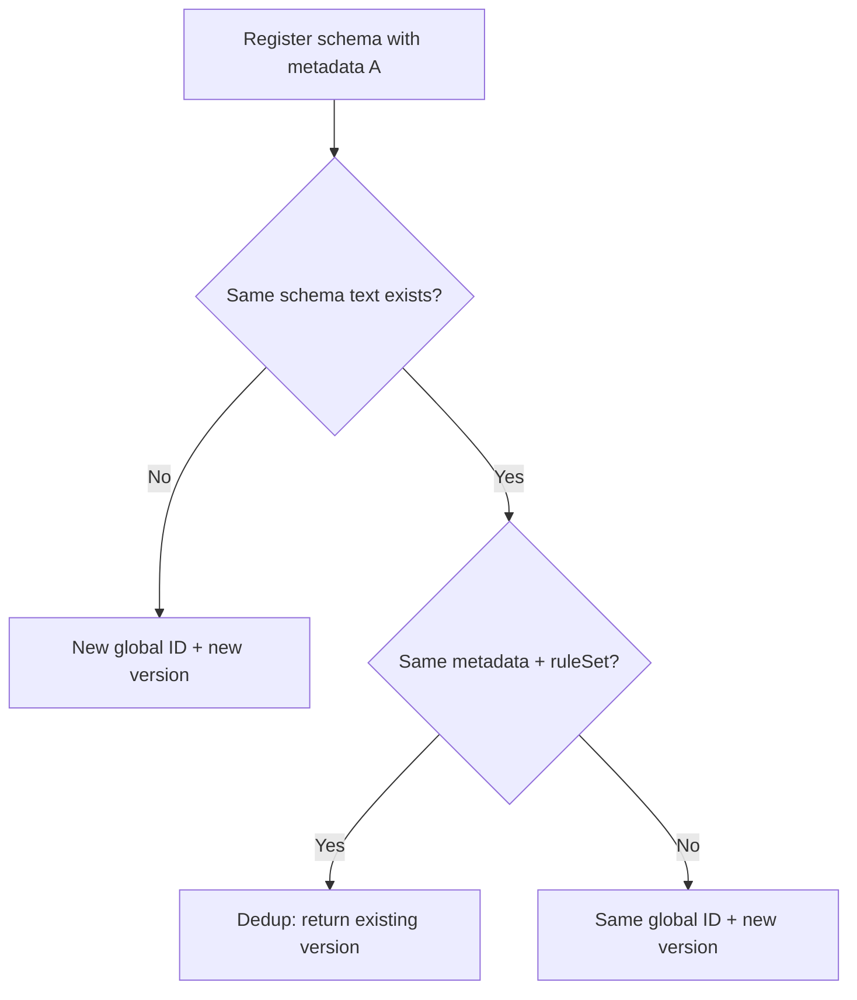
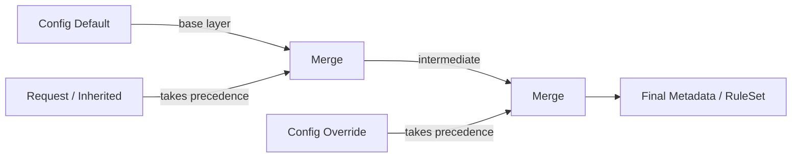

# Data Contracts

Data contracts bring governance, validation, and transformation rules directly into your schema registry. They let teams attach descriptive metadata and executable rules to schemas, turning schema registration from a passive storage operation into an active governance checkpoint.

This feature is **Confluent-compatible**: the `metadata`, `ruleSet`, `defaultMetadata`, `overrideMetadata`, `defaultRuleSet`, and `overrideRuleSet` fields follow the same JSON structure and merge semantics used by Confluent Schema Registry.

## Contents

- [What Are Data Contracts?](#what-are-data-contracts)
- [Metadata](#metadata)
  - [Properties](#properties)
  - [Tags](#tags)
  - [Sensitive Fields](#sensitive-fields)
  - [How Metadata Affects Schema Identity](#how-metadata-affects-schema-identity)
- [RuleSets](#rulesets)
  - [Rule Types](#rule-types)
  - [Rule Structure](#rule-structure)
  - [Domain Rules](#domain-rules)
  - [Migration Rules](#migration-rules)
  - [Encoding Rules](#encoding-rules)
- [Config-Level Defaults and Overrides](#config-level-defaults-and-overrides)
  - [The 3-Layer Merge](#the-3-layer-merge)
  - [Inheritance from Previous Versions](#inheritance-from-previous-versions)
  - [Merge Behavior in Detail](#merge-behavior-in-detail)
- [Optimistic Concurrency with confluent:version](#optimistic-concurrency-with-confluentversion)
  - [How It Works](#how-it-works)
  - [Auto-Population in Responses](#auto-population-in-responses)
- [Looking Up Schemas with Metadata](#looking-up-schemas-with-metadata)
- [Complete Examples](#complete-examples)
  - [Register a Schema with Metadata and Rules](#register-a-schema-with-metadata-and-rules)
  - [Set Config with Default Metadata and RuleSet](#set-config-with-default-metadata-and-ruleset)
  - [Register a Schema That Inherits Defaults](#register-a-schema-that-inherits-defaults)
  - [Verify Metadata in GET Response](#verify-metadata-in-get-response)
  - [Optimistic Concurrency Example](#optimistic-concurrency-example)
- [Related Documentation](#related-documentation)

---

## What Are Data Contracts?

A **data contract** is a set of governance policies attached to a schema. While a schema defines the *structure* of your data (field names, types, nesting), a data contract defines the *rules* around that data -- who owns it, how it MUST be validated, how it SHOULD be transformed during evolution, and which fields contain sensitive information.

Think of it this way: if a schema is a blueprint for a building, a data contract is the building code that specifies safety requirements, inspection checkpoints, and renovation rules.

A data contract has two parts:

| Part | Purpose | Analogy |
|------|---------|---------|
| **Metadata** | Descriptive information about the schema -- ownership, classification, sensitivity labels | Labels on a shipping package: who sent it, what's inside, how to handle it |
| **RuleSet** | Executable rules that govern validation, transformation, and serialization | Quality control checks at a factory: inspect before shipping, transform during upgrades |

Both parts are optional. You can use metadata alone for documentation and governance, rules alone for enforcement, or both together for a complete data contract.

> Data contracts are stored alongside the schema in the registry. They do not change how the schema itself is parsed or compiled -- they are additional governance metadata that clients and data pipelines can read and act on.

---

## Metadata

Metadata is a structured object with three fields: **properties**, **tags**, and **sensitive**. It attaches descriptive information to a schema version without changing the schema itself.

### Properties

Properties are arbitrary **key-value string pairs** that describe the schema. There are no restrictions on which keys you use -- you define whatever is meaningful to your organization.

Common property keys include:

| Key | Example Value | Purpose |
|-----|---------------|---------|
| `owner` | `payments-team` | Team responsible for this schema |
| `domain` | `billing` | Business domain |
| `classification` | `internal` | Data classification level |
| `pii` | `true` | Whether the schema contains PII |
| `sla` | `99.9%` | Availability commitment |
| `confluent:version` | `3` | Special property for optimistic concurrency (see [below](#optimistic-concurrency-with-confluentversion)) |

Properties are registered as part of the `metadata` object:

```json
{
  "metadata": {
    "properties": {
      "owner": "payments-team",
      "domain": "billing",
      "classification": "internal"
    }
  }
}
```

### Tags

Tags provide **field-level categorization**. Each tag key is a field path in the schema, and the value is a list of tag labels applied to that field. Tags let you annotate individual fields with governance labels without modifying the schema definition.

For example, you might tag fields that contain personally identifiable information (PII), fields subject to regulatory requirements, or fields that require encryption:

```json
{
  "metadata": {
    "tags": {
      "*.email": ["PII", "GDPR"],
      "*.ssn": ["PII", "SENSITIVE", "ENCRYPTED"],
      "*.account_id": ["INTERNAL_ID"]
    }
  }
}
```

Tag keys use dot-separated field paths. The `*` wildcard matches any record name, so `*.email` applies to any field named `email` regardless of which record contains it.

### Sensitive Fields

The `sensitive` list identifies field names that contain sensitive data. This is a convenience shorthand -- instead of tagging every sensitive field individually, you can list them all in one place:

```json
{
  "metadata": {
    "sensitive": ["email", "ssn", "phone_number", "credit_card"]
  }
}
```

Clients and data pipelines can read this list to apply masking, encryption, or access control automatically.

### How Metadata Affects Schema Identity

Metadata interacts with schema identity in two important ways:

1. **Metadata does NOT affect global schema ID allocation.** The global ID is determined by the schema text (its content-addressed fingerprint). If you register the same schema text with different metadata, the registry reuses the same global ID. This is because Kafka's wire format embeds the schema ID, and identical schema content MUST always produce the same serialized format.

2. **Metadata DOES affect version deduplication.** If you register the same schema text under the same subject but with different metadata or rules, the registry creates a **new version** (with the same global ID). This means metadata changes are versioned -- you can track when ownership changed, when a field was tagged as PII, or when a new validation rule was added.



---

## RuleSets

A **RuleSet** is a collection of executable rules attached to a schema. Rules define validation checks, data transformations, and serialization behavior that clients SHOULD apply when producing or consuming data.

> The schema registry **stores** rules but does not **execute** them. Rule execution is the responsibility of the serializer/deserializer (SerDe) in your client application. Confluent's SerDe clients (Java, Python, .NET, Go) support rule execution natively. If you use custom clients, you MUST implement rule execution yourself.

### Rule Types

A RuleSet contains three categories of rules:

| Category | Field | When Applied | Purpose |
|----------|-------|-------------|---------|
| **Domain rules** | `domainRules` | During normal data processing (produce/consume) | Validate data quality, enforce business constraints, transform field values |
| **Migration rules** | `migrationRules` | During schema evolution (upgrade/downgrade) | Transform data between schema versions when consumers lag behind producers |
| **Encoding rules** | `encodingRules` | During serialization/deserialization | Apply field-level encryption, compression, or encoding transformations |

### Rule Structure

Each rule in a RuleSet has the following fields:

| Field | Type | Required | Description |
|-------|------|----------|-------------|
| `name` | string | Yes | Unique name for this rule within its category |
| `doc` | string | No | Human-readable description of what the rule does |
| `kind` | string | Yes | `CONDITION` (validates, returns true/false) or `TRANSFORM` (modifies data) |
| `mode` | string | Yes | When the rule applies: `WRITE`, `READ`, `WRITEREAD`, `UPGRADE`, or `DOWNGRADE` |
| `type` | string | No | Rule engine type (e.g., `CEL`, `CEL_FIELD`, `JSONATA`, `ENCRYPT`) |
| `tags` | list | No | Field tags this rule applies to (used with `CEL_FIELD` to target tagged fields) |
| `params` | map | No | Key-value parameters passed to the rule engine |
| `expr` | string | No | The rule expression (syntax depends on `type`) |
| `onSuccess` | string | No | Action when rule succeeds: `NONE` (default) or `ERROR` |
| `onFailure` | string | No | Action when rule fails: `NONE`, `ERROR` (default for CONDITION), or `DLQ` |
| `disabled` | bool | No | If `true`, rule is stored but not executed |

The `kind` field determines how the rule behaves:

- **`CONDITION`** rules evaluate an expression and return true or false. If the condition fails, the action specified in `onFailure` is taken (typically rejecting the message).
- **`TRANSFORM`** rules modify the data in place. The expression receives the data and returns the transformed version.

The `mode` field determines when the rule is evaluated:

| Mode | Applied By | Use Case |
|------|-----------|----------|
| `WRITE` | Producer (serializer) | Validate data before sending to Kafka |
| `READ` | Consumer (deserializer) | Validate or transform data after reading from Kafka |
| `WRITEREAD` | Both producer and consumer | Rules that MUST apply in both directions |
| `UPGRADE` | Consumer (when reading older schema version) | Transform old-format data to new format |
| `DOWNGRADE` | Producer (when writing for older consumers) | Transform new-format data to old format |

### Domain Rules

Domain rules enforce business logic during normal data processing. They are the most common type of rule.

**Example: Validate that an amount field is positive**

```json
{
  "ruleSet": {
    "domainRules": [
      {
        "name": "amount-must-be-positive",
        "doc": "Order amounts must be greater than zero",
        "kind": "CONDITION",
        "mode": "WRITE",
        "type": "CEL",
        "expr": "message.amount > 0",
        "onFailure": "ERROR"
      }
    ]
  }
}
```

**Example: Transform a field value on read**

```json
{
  "ruleSet": {
    "domainRules": [
      {
        "name": "uppercase-country",
        "doc": "Normalize country code to uppercase on read",
        "kind": "TRANSFORM",
        "mode": "READ",
        "type": "CEL",
        "expr": "message.country.upperAscii()"
      }
    ]
  }
}
```

### Migration Rules

Migration rules handle schema evolution. When a consumer reads data written with an older (or newer) schema version, migration rules transform the data to match the consumer's expected format.

**Example: Add a default value during upgrade**

```json
{
  "ruleSet": {
    "migrationRules": [
      {
        "name": "add-currency-default",
        "doc": "Set currency to USD when upgrading from v1 (which lacked the field)",
        "kind": "TRANSFORM",
        "mode": "UPGRADE",
        "type": "JSONATA",
        "expr": "$ ~> |$|{'currency': 'USD'}|"
      },
      {
        "name": "remove-currency-on-downgrade",
        "doc": "Strip currency field when downgrading to v1",
        "kind": "TRANSFORM",
        "mode": "DOWNGRADE",
        "type": "JSONATA",
        "expr": "$ ~> |$|{}, ['currency']|"
      }
    ]
  }
}
```

### Encoding Rules

Encoding rules apply during serialization and deserialization. They are commonly used for field-level encryption, where specific fields MUST be encrypted before being written to Kafka and decrypted when read.

**Example: Encrypt PII fields**

```json
{
  "ruleSet": {
    "encodingRules": [
      {
        "name": "encrypt-pii",
        "doc": "Encrypt all fields tagged as PII",
        "kind": "TRANSFORM",
        "mode": "WRITEREAD",
        "type": "ENCRYPT",
        "tags": ["PII"],
        "params": {
          "encrypt.kek.name": "my-kek",
          "encrypt.kms.type": "aws-kms",
          "encrypt.kms.key.id": "arn:aws:kms:us-east-1:123456789:key/my-key-id"
        }
      }
    ]
  }
}
```

---

## Config-Level Defaults and Overrides

When many schemas under the same subject (or across all subjects) need the same metadata or rules, repeating them in every registration request is tedious and error-prone. The configuration API provides two mechanisms to avoid this:

| Config Field | Purpose |
|-------------|---------|
| `defaultMetadata` | Applied to schemas when the registration request does not include explicit `metadata` |
| `overrideMetadata` | Forcefully merged on top of any metadata (whether from the request, defaults, or inherited) |
| `defaultRuleSet` | Applied to schemas when the registration request does not include an explicit `ruleSet` |
| `overrideRuleSet` | Forcefully merged on top of any ruleSet |

These fields are set via the `PUT /config` or `PUT /config/{subject}` endpoints, alongside the compatibility level.

### The 3-Layer Merge

When a schema is registered, the registry computes the final metadata and ruleSet using a **3-layer merge**:

```
final = merge(merge(config.default, request-specific), config.override)
```

In detail:

1. **Start with config defaults.** If `defaultMetadata` or `defaultRuleSet` is configured for the subject (or globally), use it as the base layer.
2. **Merge request-specific values on top.** If the registration request includes `metadata` or `ruleSet`, merge them on top of the defaults. Request values take precedence over defaults for any conflicting keys.
3. **Merge config overrides on top.** If `overrideMetadata` or `overrideRuleSet` is configured, merge them on top of everything. Override values take precedence over both defaults and request values.



This design lets platform teams enforce governance policies (via overrides) while still allowing individual teams to add their own metadata and rules (via request values or defaults).

### Inheritance from Previous Versions

If a registration request does not include `metadata` or `ruleSet`, and no config defaults are set, the registry **inherits metadata and ruleSet from the previous version** of the subject. This ensures continuity -- when you register a new schema version, you do not lose the metadata from the previous version unless you explicitly replace it.

The inheritance order is:

1. If the request includes `metadata` -- use it.
2. If not, and a previous version exists -- inherit its metadata.
3. Then apply the 3-layer merge (default, inherited/request, override).

The same logic applies to `ruleSet`.

### Merge Behavior in Detail

The merge operation works differently for each field within metadata and ruleSet:

**Metadata merge:**

| Field | Merge Strategy |
|-------|---------------|
| `properties` | Key-value merge. Override values replace base values for the same key. New keys from the override are added. |
| `tags` | Key-value merge (same as properties). Override tag lists replace base tag lists for the same field path. |
| `sensitive` | Union (deduplicated). Sensitive fields from both sides are combined without duplicates. |

**RuleSet merge:**

| Field | Merge Strategy |
|-------|---------------|
| `domainRules` | Rules merged by name. Override rules replace base rules with the same `name`. New rules are appended. |
| `migrationRules` | Same as domainRules. |
| `encodingRules` | Same as domainRules. |

---

## Optimistic Concurrency with confluent:version

The special metadata property `confluent:version` provides **optimistic concurrency control** (also known as compare-and-set, or CAS) during schema registration. It is a soft guard -- mismatches never produce errors, they simply skip deduplication.

### How It Works

When you include `confluent:version` in the metadata properties of a registration request, the registry uses it as a hint during deduplication:

1. **If `confluent:version=N` and version N already exists with the same schema text, metadata, and ruleSet** -- dedup fires and the existing version is returned. This is the normal idempotent behavior.

2. **If `confluent:version=N` and version N exists but with different schema text or metadata** -- dedup is skipped and the schema is registered as a new version. No error is raised.

3. **If `confluent:version=N` and version N does not exist** -- the schema is registered normally (the CAS hint has no effect since there is nothing to compare against).

4. **If `confluent:version` is not specified** -- standard dedup rules apply (same schema text + same metadata = return existing version).

This mechanism is useful for CI/CD pipelines that want to ensure they are updating the expected version. If another pipeline registered a new version concurrently, the CAS mismatch causes a new version to be created rather than silently deduplicating.

> `confluent:version` is a **control property**, not a permanent metadata field. It is stripped from the metadata before storage and auto-populated in responses. You SHOULD NOT rely on it being present in stored metadata.

### Auto-Population in Responses

When you retrieve a schema version (via `GET /subjects/{subject}/versions/{version}` or similar endpoints), the response metadata automatically includes `confluent:version` set to the actual version number:

```json
{
  "subject": "orders-value",
  "version": 3,
  "id": 12,
  "schemaType": "AVRO",
  "schema": "...",
  "metadata": {
    "properties": {
      "owner": "payments-team",
      "confluent:version": "3"
    }
  }
}
```

This auto-population happens regardless of whether `confluent:version` was specified during registration. It allows consumers of the API to always know the version number from the metadata without parsing the top-level `version` field separately.

---

## Looking Up Schemas with Metadata

Different API endpoints return metadata and ruleSet in different ways:

| Endpoint | Returns Metadata? | Notes |
|----------|------------------|-------|
| `GET /subjects/{subject}/versions/{version}` | Yes | Returns `metadata` and `ruleSet` for the specific subject-version. Includes auto-populated `confluent:version`. |
| `GET /subjects/{subject}/versions` | No | Returns a list of version numbers only. |
| `GET /schemas/ids/{id}` | Yes | Returns `metadata` and `ruleSet`. Note that metadata is stored per subject-version, so the same global ID MAY have different metadata in different subjects. |
| `POST /subjects/{subject}` (lookup) | Yes | Finds an existing schema by schema text. Metadata is NOT considered during lookup matching -- the match is based on schema text only. Returns the metadata of the matched version. |
| `GET /schemas` (list) | Yes | Returns `metadata` and `ruleSet` for each schema in the list. |

**Key point:** The schema lookup endpoint (`POST /subjects/{subject}`) matches by schema text only. If you have two versions with the same text but different metadata, the lookup returns the first match. It does NOT filter by metadata.

---

## Complete Examples

All examples use `curl` against a registry running at `http://localhost:8081`.

### Register a Schema with Metadata and Rules

Register an Avro schema for the `orders-value` subject with ownership metadata, PII tags, and a domain validation rule:

```bash
curl -X POST http://localhost:8081/subjects/orders-value/versions \
  -H "Content-Type: application/vnd.schemaregistry.v1+json" \
  -d '{
    "schema": "{\"type\":\"record\",\"name\":\"Order\",\"fields\":[{\"name\":\"id\",\"type\":\"int\"},{\"name\":\"amount\",\"type\":\"double\"},{\"name\":\"email\",\"type\":\"string\"}]}",
    "metadata": {
      "properties": {
        "owner": "payments-team",
        "domain": "billing",
        "classification": "confidential"
      },
      "tags": {
        "*.email": ["PII", "GDPR"]
      },
      "sensitive": ["email"]
    },
    "ruleSet": {
      "domainRules": [
        {
          "name": "amount-must-be-positive",
          "doc": "Order amounts must be greater than zero",
          "kind": "CONDITION",
          "mode": "WRITE",
          "type": "CEL",
          "expr": "message.amount > 0",
          "onFailure": "ERROR"
        }
      ],
      "migrationRules": [
        {
          "name": "add-currency-default",
          "doc": "Set currency to USD when upgrading from v1",
          "kind": "TRANSFORM",
          "mode": "UPGRADE",
          "type": "JSONATA",
          "expr": "$ ~> |$|{'\''currency'\\'' : '\''USD'\\''}|"
        }
      ]
    }
  }'
```

Response:

```json
{"id": 1}
```

### Set Config with Default Metadata and RuleSet

Configure the `orders-value` subject with default metadata and a default encoding rule. All future schema registrations under this subject will inherit these defaults unless explicitly overridden:

```bash
curl -X PUT http://localhost:8081/config/orders-value \
  -H "Content-Type: application/vnd.schemaregistry.v1+json" \
  -d '{
    "compatibility": "BACKWARD",
    "defaultMetadata": {
      "properties": {
        "owner": "payments-team",
        "domain": "billing"
      },
      "sensitive": ["email", "phone"]
    },
    "defaultRuleSet": {
      "domainRules": [
        {
          "name": "amount-positive",
          "kind": "CONDITION",
          "mode": "WRITE",
          "type": "CEL",
          "expr": "message.amount > 0",
          "onFailure": "ERROR"
        }
      ]
    },
    "overrideMetadata": {
      "properties": {
        "env": "production"
      }
    }
  }'
```

Response:

```json
{"compatibility": "BACKWARD"}
```

This configuration sets up three layers:

- **Default metadata:** `owner=payments-team`, `domain=billing`, sensitive fields `email` and `phone`
- **Default ruleSet:** a domain rule requiring positive amounts
- **Override metadata:** `env=production` (always applied, cannot be overridden by requests)

### Register a Schema That Inherits Defaults

Now register a schema under the same subject **without** specifying metadata or ruleSet. The defaults from the config will be applied automatically:

```bash
curl -X POST http://localhost:8081/subjects/orders-value/versions \
  -H "Content-Type: application/vnd.schemaregistry.v1+json" \
  -d '{
    "schema": "{\"type\":\"record\",\"name\":\"Order\",\"fields\":[{\"name\":\"id\",\"type\":\"int\"},{\"name\":\"amount\",\"type\":\"double\"},{\"name\":\"email\",\"type\":\"string\"}]}"
  }'
```

Response:

```json
{"id": 1}
```

Even though the request did not include metadata or ruleSet, the stored version will have:

- **metadata.properties:** `{"owner": "payments-team", "domain": "billing", "env": "production"}` (default + override merged)
- **metadata.sensitive:** `["email", "phone"]` (from default)
- **ruleSet.domainRules:** the `amount-positive` rule (from default)

### Verify Metadata in GET Response

Retrieve the version to confirm that defaults and overrides were applied:

```bash
curl http://localhost:8081/subjects/orders-value/versions/1
```

Response:

```json
{
  "subject": "orders-value",
  "id": 1,
  "version": 1,
  "schemaType": "AVRO",
  "schema": "{\"type\":\"record\",\"name\":\"Order\",\"fields\":[{\"name\":\"id\",\"type\":\"int\"},{\"name\":\"amount\",\"type\":\"double\"},{\"name\":\"email\",\"type\":\"string\"}]}",
  "metadata": {
    "properties": {
      "owner": "payments-team",
      "domain": "billing",
      "env": "production",
      "confluent:version": "1"
    },
    "sensitive": ["email", "phone"]
  },
  "ruleSet": {
    "domainRules": [
      {
        "name": "amount-positive",
        "kind": "CONDITION",
        "mode": "WRITE",
        "type": "CEL",
        "expr": "message.amount > 0",
        "onFailure": "ERROR"
      }
    ]
  }
}
```

Note that `confluent:version` has been auto-populated with value `"1"` (the assigned version number), and the `env` property from the override config is present even though it was not in the request.

### Optimistic Concurrency Example

Use `confluent:version` to guard against concurrent updates. First, register a schema targeting version 1:

```bash
curl -X POST http://localhost:8081/subjects/payments-value/versions \
  -H "Content-Type: application/vnd.schemaregistry.v1+json" \
  -d '{
    "schema": "{\"type\":\"record\",\"name\":\"Payment\",\"fields\":[{\"name\":\"id\",\"type\":\"int\"},{\"name\":\"amount\",\"type\":\"double\"}]}",
    "metadata": {
      "properties": {
        "owner": "payments-team",
        "confluent:version": "1"
      }
    }
  }'
```

Response:

```json
{"id": 1}
```

Now try to register the same schema text with `confluent:version=1` again. Since version 1 already exists with the same content, dedup fires:

```bash
curl -X POST http://localhost:8081/subjects/payments-value/versions \
  -H "Content-Type: application/vnd.schemaregistry.v1+json" \
  -d '{
    "schema": "{\"type\":\"record\",\"name\":\"Payment\",\"fields\":[{\"name\":\"id\",\"type\":\"int\"},{\"name\":\"amount\",\"type\":\"double\"}]}",
    "metadata": {
      "properties": {
        "owner": "payments-team",
        "confluent:version": "1"
      }
    }
  }'
```

Response (idempotent -- returns existing version):

```json
{"id": 1}
```

Now register the same schema text but with `confluent:version=2` (no version 2 exists yet). The CAS hint does not match an existing version, so the registry skips dedup and creates a new version:

```bash
curl -X POST http://localhost:8081/subjects/payments-value/versions \
  -H "Content-Type: application/vnd.schemaregistry.v1+json" \
  -d '{
    "schema": "{\"type\":\"record\",\"name\":\"Payment\",\"fields\":[{\"name\":\"id\",\"type\":\"int\"},{\"name\":\"amount\",\"type\":\"double\"}]}",
    "metadata": {
      "properties": {
        "owner": "payments-team",
        "confluent:version": "2"
      }
    }
  }'
```

Response (new version created with the same global ID):

```json
{"id": 1}
```

---

## Related Documentation

- [Fundamentals](fundamentals.md) -- core schema registry concepts including schema IDs, subjects, and deduplication
- [Compatibility](compatibility.md) -- compatibility modes, configuration, and compatibility groups
- [Configuration](configuration.md) -- YAML configuration reference
- [API Reference](api-reference.md) -- complete endpoint documentation
- [Contexts](contexts.md) -- multi-tenancy and namespace isolation
- [Schema Types](schema-types.md) -- Avro, Protobuf, and JSON Schema support
