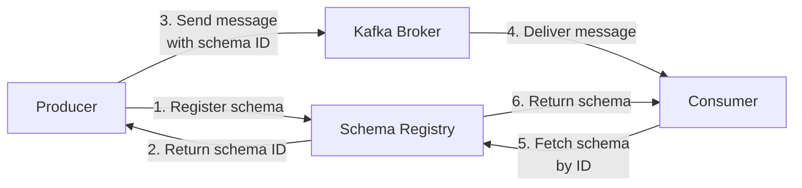
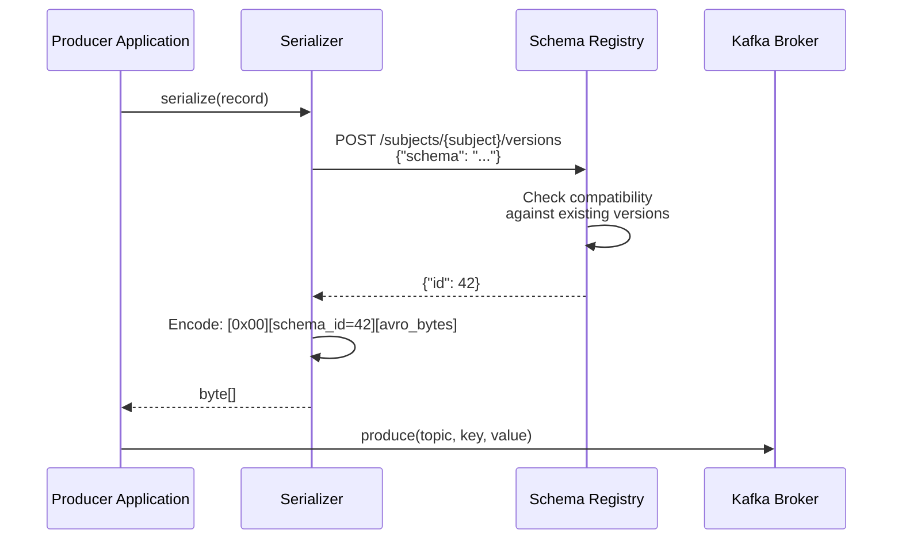
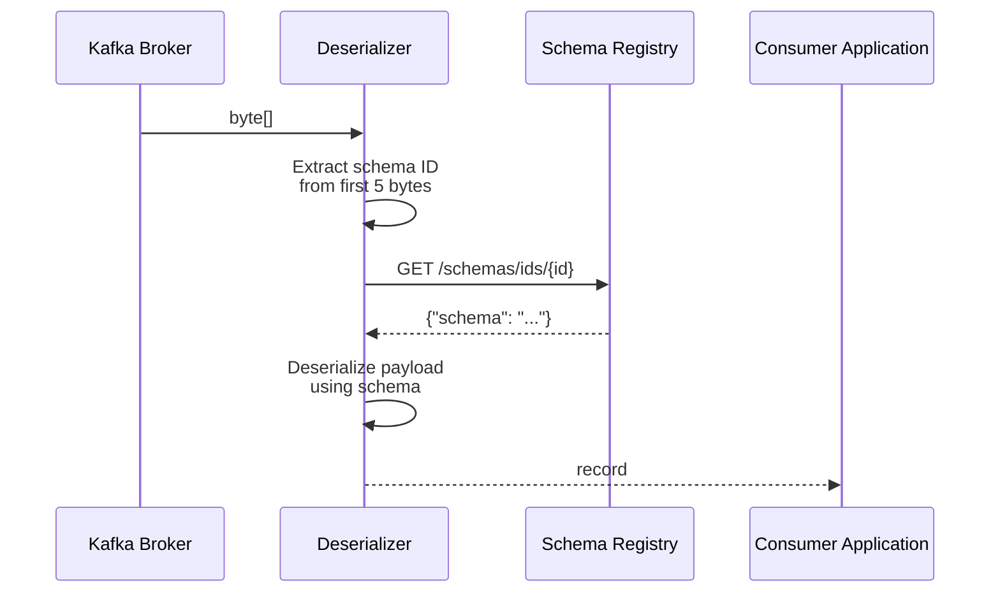
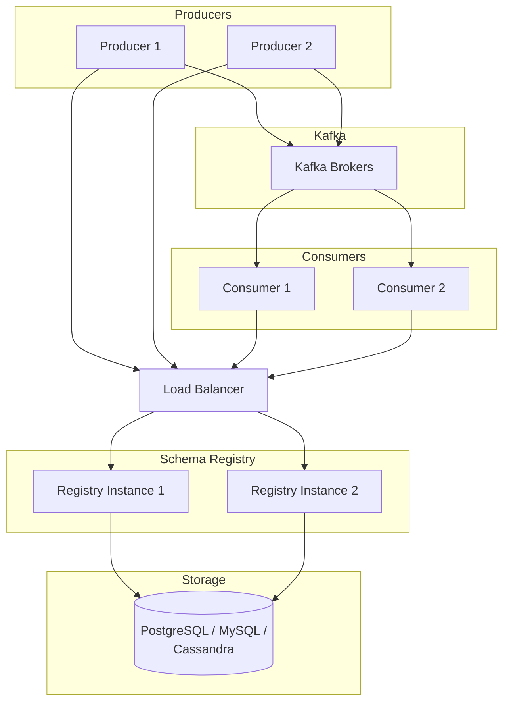

# Schema Registry Fundamentals

This document introduces the core concepts behind a schema registry, explains why it matters in event-driven architectures, and describes how AxonOps Schema Registry works.

## Contents

- [What Is a Schema Registry?](#what-is-a-schema-registry)
- [The Problem: Schema Evolution in Event Streaming](#the-problem-schema-evolution-in-event-streaming)
- [How a Schema Registry Solves This](#how-a-schema-registry-solves-this)
- [Core Concepts](#core-concepts)
  - [Schemas](#schemas)
  - [Subjects](#subjects)
  - [Versions](#versions)
  - [Schema IDs](#schema-ids)
  - [Compatibility](#compatibility)
  - [References](#references)
- [How It Works: The Registration and Serialization Flow](#how-it-works-the-registration-and-serialization-flow)
  - [Producer: Registering and Serializing](#producer-registering-and-serializing)
  - [Consumer: Deserializing](#consumer-deserializing)
  - [The Wire Format](#the-wire-format)
- [Subjects, Topics, and Naming Strategies](#subjects-topics-and-naming-strategies)
  - [TopicNameStrategy (Default)](#topicnamestrategy-default)
  - [RecordNameStrategy](#recordnamestrategy)
  - [TopicRecordNameStrategy](#topicrecordnamestrategy)
- [Schema Evolution and Compatibility](#schema-evolution-and-compatibility)
  - [Why Compatibility Matters](#why-compatibility-matters)
  - [Compatibility Modes](#compatibility-modes)
  - [Choosing a Compatibility Mode](#choosing-a-compatibility-mode)
- [Supported Schema Formats](#supported-schema-formats)
- [Schema ID Allocation](#schema-id-allocation)
- [Schema Deduplication](#schema-deduplication)
- [Modes: Controlling Write Access](#modes-controlling-write-access)
- [Architecture: Where the Registry Fits](#architecture-where-the-registry-fits)
- [Related Documentation](#related-documentation)

## What Is a Schema Registry?

A schema registry is a centralized service that stores and manages **schemas** -- the formal definitions of data structures -- used by producers and consumers in an event streaming platform. It acts as the single source of truth for what data looks like, ensuring that every application writing to or reading from a Kafka topic agrees on the structure of the messages.

Without a schema registry, producers can change the shape of their data at any time, and consumers have no way to know what format to expect. This leads to deserialization failures, data corruption, silent data loss, and difficult-to-debug production incidents.

A schema registry prevents this by:

1. **Storing schemas centrally** -- every data structure is registered and versioned.
2. **Enforcing compatibility** -- new schema versions are checked against previous versions before they are accepted.
3. **Embedding schema IDs in messages** -- each Kafka message carries a compact reference to its schema, so consumers always know how to decode it.
4. **Decoupling producers from consumers** -- teams can evolve their schemas independently as long as they respect the compatibility contract.

## The Problem: Schema Evolution in Event Streaming

Consider a Kafka topic `orders` used by an e-commerce platform. The order events start simple:

```json
{"order_id": 1001, "amount": 49.99, "customer": "alice"}
```

Over time, requirements grow. The payments team needs a `currency` field. The shipping team needs an `address` object. The analytics team wants a `timestamp`. Each change to the event structure is a **schema evolution**.

The challenge is that in a distributed system, producers and consumers deploy independently. When the orders service adds a `currency` field:

- **Old consumers** that don't know about `currency` receive messages with an unexpected field. Will they crash? Silently ignore it? Misparse the data?
- **New consumers** deployed before the producer update expect `currency` but receive messages without it. Will they throw a null pointer exception?

Without governance, every schema change is a potential production incident. Multiply this across hundreds of topics and dozens of teams, and schema evolution becomes a major operational risk.

## How a Schema Registry Solves This

A schema registry sits alongside your Kafka cluster and acts as a gatekeeper:



1. **Before producing**, the serializer registers the schema with the registry (or retrieves the ID if it already exists).
2. **The registry checks compatibility** -- if the schema violates the compatibility policy, registration is rejected and the producer fails fast, before any bad data enters Kafka.
3. **The schema ID is embedded** in every message (a 5-byte prefix: 1 magic byte + 4-byte ID).
4. **Consumers fetch the schema** by ID from the registry and use it to deserialize the message correctly.

The result: producers and consumers can evolve independently, and the registry guarantees that changes are safe.

## Core Concepts

### Schemas

A **schema** is a formal definition of a data structure. It specifies the fields, their types, default values, and constraints. AxonOps Schema Registry supports three schema formats:

- **Avro** -- a compact binary format with rich type system, widely used in Kafka ecosystems
- **Protobuf** -- Google's language-neutral serialization format (proto2 and proto3)
- **JSON Schema** -- a vocabulary for annotating and validating JSON documents

Each schema is stored centrally and assigned a **globally unique ID**.

### Subjects

A **subject** is a named scope under which schema versions are registered. Subjects are the primary organizational unit in a schema registry. By default, each Kafka topic has two subjects:

- `<topic-name>-key` for the message key schema
- `<topic-name>-value` for the message value schema

For example, a topic called `orders` would have subjects `orders-key` and `orders-value`.

Subjects can also follow other naming strategies -- see [Subjects, Topics, and Naming Strategies](#subjects-topics-and-naming-strategies).

### Versions

Each time a new schema is registered under a subject, it is assigned a **version number** starting from 1 and incrementing by 1 for each subsequent registration. Versions are immutable -- once a version is registered, it cannot be changed.

Registering the same schema content again does not create a new version. The registry recognizes it as a duplicate and returns the existing version and ID.

### Schema IDs

Every unique schema is assigned a **globally unique integer ID**. This ID is what gets embedded in Kafka messages. When a consumer reads a message, it extracts the schema ID from the message header and fetches the corresponding schema from the registry.

Schema IDs are:
- **Globally unique** -- no two different schemas share an ID, regardless of subject
- **Stable** -- once assigned, an ID never changes
- **Monotonically increasing** -- newer schemas get higher IDs

### Compatibility

**Compatibility** is a policy that controls whether a new schema version is allowed based on its relationship to previous versions. When you register a new version under a subject, the registry checks it against the existing versions according to the subject's compatibility mode. If the check fails, the registration is rejected.

See [Schema Evolution and Compatibility](#schema-evolution-and-compatibility) for details on all 7 modes.

### References

A **reference** is a pointer from one schema to another, enabling cross-subject schema composition:

- **Avro**: Named type references (e.g., a `Customer` record defined in one subject and used in another)
- **Protobuf**: `import` statements referencing types from other `.proto` definitions
- **JSON Schema**: `$ref` pointing to schemas in other subjects

References allow complex data models to be built from reusable, independently versioned components.

## How It Works: The Registration and Serialization Flow

### Producer: Registering and Serializing

When a Kafka producer sends a message using a schema-aware serializer (such as the Confluent Avro serializer), the following happens:



1. The application passes a record to the serializer.
2. The serializer extracts the schema from the record and registers it with the schema registry.
3. The registry checks compatibility and returns the schema ID (or rejects the registration).
4. The serializer prepends the schema ID to the serialized bytes.
5. The message is produced to Kafka.

The serializer caches schema IDs locally, so the registry call only happens on the first use of each schema.

### Consumer: Deserializing



1. The consumer receives raw bytes from Kafka.
2. The deserializer reads the magic byte and 4-byte schema ID from the message prefix.
3. It fetches the schema from the registry by ID (cached after first fetch).
4. It deserializes the remaining bytes using the schema.
5. The application receives a typed record.

### The Wire Format

Every message produced through a schema-aware serializer follows this binary layout:

```
┌──────────┬───────────────────┬─────────────────────────┐
│ Magic    │ Schema ID         │ Serialized Payload      │
│ Byte     │ (4 bytes, big-    │ (Avro binary, Protobuf  │
│ (0x00)   │ endian int)       │ binary, or JSON)        │
│ 1 byte   │                   │                         │
└──────────┴───────────────────┴─────────────────────────┘
```

The magic byte `0x00` signals that this message uses the schema registry wire format. The schema ID tells the consumer which schema to use for deserialization. This 5-byte overhead is the only cost of using a schema registry.

## Subjects, Topics, and Naming Strategies

The **subject name strategy** controls how a subject name is derived from a Kafka topic and schema. The strategy is configured on the producer's serializer.

### TopicNameStrategy (Default)

The subject name is based on the Kafka topic:

- Key schema: `<topic>-key`
- Value schema: `<topic>-value`

This is the simplest and most common strategy. It means each topic has its own independent schema evolution.

```
Topic: orders  →  Subject: orders-value
Topic: users   →  Subject: users-value
```

### RecordNameStrategy

The subject name is the fully qualified name of the record type:

- `com.example.Order`
- `com.example.User`

This is useful when the same record type is used across multiple topics and you want a single schema definition for that type regardless of which topic it appears in.

```
Topic: orders  (record: com.example.Order)  →  Subject: com.example.Order
Topic: returns (record: com.example.Order)  →  Subject: com.example.Order
```

### TopicRecordNameStrategy

Combines the topic name and record name:

- `orders-com.example.Order`
- `users-com.example.User`

This allows different topics to have different schemas even for the same record type.

```
Topic: orders  (record: com.example.Order)  →  Subject: orders-com.example.Order
Topic: returns (record: com.example.Order)  →  Subject: returns-com.example.Order
```

> **Note:** The subject name strategy is a client-side configuration on the serializer. The schema registry itself does not enforce a naming strategy -- it accepts any subject name. The strategies above are conventions used by Confluent serializers.

## Schema Evolution and Compatibility

### Why Compatibility Matters

In a distributed system, producers and consumers are deployed independently. A producer might be updated to write a new schema version while consumers are still running an older version. Compatibility rules ensure that this mismatch does not cause failures.

Consider a subject with schema v1:

```json
{"type": "record", "name": "User", "fields": [
  {"name": "id", "type": "int"},
  {"name": "name", "type": "string"}
]}
```

If v2 adds a new field with a default value:

```json
{"type": "record", "name": "User", "fields": [
  {"name": "id", "type": "int"},
  {"name": "name", "type": "string"},
  {"name": "email", "type": ["null", "string"], "default": null}
]}
```

This is a **backward-compatible** change: consumers using v1 can still read data written with v2 (they simply ignore the `email` field). And consumers using v2 can read data written with v1 (they use the default value `null` for the missing `email` field).

### Compatibility Modes

AxonOps Schema Registry supports 7 compatibility modes:

| Mode | Checked Against | Meaning |
|------|----------------|---------|
| **NONE** | Nothing | No compatibility checking. Any schema is accepted. |
| **BACKWARD** | Latest version | Consumers using the new schema can read data produced with the previous schema. |
| **BACKWARD_TRANSITIVE** | All versions | Consumers using the new schema can read data produced with any previous schema. |
| **FORWARD** | Latest version | Consumers using the previous schema can read data produced with the new schema. |
| **FORWARD_TRANSITIVE** | All versions | Consumers using any previous schema can read data produced with the new schema. |
| **FULL** | Latest version | Both backward and forward compatible with the previous schema. |
| **FULL_TRANSITIVE** | All versions | Both backward and forward compatible with all previous schemas. |

The default compatibility mode is **BACKWARD**.

### Choosing a Compatibility Mode

| Scenario | Recommended Mode |
|----------|-----------------|
| Consumers always deploy before producers | **BACKWARD** |
| Producers always deploy before consumers | **FORWARD** |
| No control over deployment order | **FULL** |
| Long-lived data (cold storage, replay) | **BACKWARD_TRANSITIVE** or **FULL_TRANSITIVE** |
| Rapid prototyping, no compatibility needed | **NONE** |

For more detail on per-schema-type compatibility rules, see the [Compatibility](compatibility.md) documentation.

## Supported Schema Formats

| Format | Description | Use Case |
|--------|------------|----------|
| **Avro** | Compact binary format with rich type system, schema evolution built in. Schemas are JSON documents describing records, enums, arrays, maps, and unions. | Most common in Kafka ecosystems. Default format when `schemaType` is omitted. |
| **Protobuf** | Google's language-neutral binary serialization. Supports proto2 and proto3 syntax, nested messages, enums, oneofs, maps, and service definitions. | Cross-language microservices, gRPC integration. |
| **JSON Schema** | A vocabulary for annotating and validating JSON documents. Supports Draft-04, Draft-06, Draft-07, Draft 2019-09, and Draft 2020-12. | JSON-native applications, REST APIs producing to Kafka. |

All three formats support schema references for composing complex schemas from reusable, independently versioned components. For detailed information on each format, see the [Schema Types](schema-types.md) documentation.

## Schema ID Allocation

Schema IDs are globally unique, monotonically increasing integers. The registry allocates IDs sequentially as new schemas are registered. The allocation mechanism depends on the storage backend:

- **PostgreSQL / MySQL**: Auto-incrementing sequences with transaction isolation
- **Cassandra**: Block-based allocation using lightweight transactions (LWT) to minimize contention
- **Memory**: Simple atomic counter

When a schema is registered that is content-identical to an existing schema (same canonical form and fingerprint), the existing ID is returned rather than allocating a new one. This is true even if the schema is registered under a different subject.

## Schema Deduplication

The registry uses **content-addressed storage** based on SHA-256 fingerprints of the canonical form of each schema. When a schema is registered:

1. The schema is parsed and converted to its canonical form (whitespace-normalized, fields ordered deterministically).
2. A SHA-256 fingerprint is computed from the canonical form.
3. If a schema with the same fingerprint already exists, the existing schema ID is returned.
4. If no match exists, a new schema ID is allocated.

This means the same logical schema registered under multiple subjects (e.g., `orders-value` and `returns-value`) shares a single schema ID, reducing storage overhead and ensuring consistency.

## Modes: Controlling Write Access

The registry supports **modes** that control whether schema registration is allowed:

| Mode | Behavior |
|------|----------|
| **READWRITE** | Normal operation. Schemas can be registered and read. (Default) |
| **READONLY** | Schema reads are allowed. New registrations are rejected. |
| **READONLY_OVERRIDE** | Like READONLY, but individual requests MAY override the restriction. |
| **IMPORT** | Allows registering schemas with specific IDs (used for migration from another registry). |

Modes can be set globally or per subject. A per-subject mode overrides the global mode for that subject.

## Architecture: Where the Registry Fits

AxonOps Schema Registry is a stateless HTTP service that sits alongside your Kafka cluster. All state is stored in the database, not in the registry process itself.



Key architectural properties:

- **Stateless** -- multiple instances can run behind a load balancer with no coordination between them. There is no leader election and no peer-to-peer communication.
- **Independent of Kafka** -- the registry does not read from or write to Kafka. It uses standard databases for storage. Kafka and the registry are separate infrastructure components.
- **High availability** -- deploy multiple instances behind a load balancer, all pointing to the same database. For multi-datacenter deployments, Cassandra's native replication provides active-active across datacenters.
- **Lightweight** -- a single binary with ~50 MB memory footprint and no runtime dependencies.

## Related Documentation

- [Getting Started](getting-started.md) -- run the registry and register your first schemas
- [Schema Types](schema-types.md) -- detailed Avro, Protobuf, and JSON Schema support
- [Compatibility](compatibility.md) -- all 7 compatibility modes with per-type rules
- [API Reference](api-reference.md) -- complete endpoint documentation
- [Storage Backends](storage-backends.md) -- PostgreSQL, MySQL, Cassandra, and in-memory setup
- [Deployment](deployment.md) -- production deployment topologies and configuration
